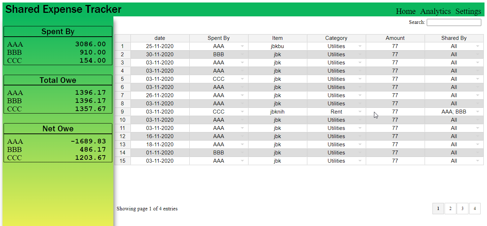

## Shared Expense Tracker
### _Log shared expenses between multiple people_

#### Usage:
1. Just open the `index.html`, that's it.
3. Records are stored in the localstorage, for easy access.
2. Update user list and categories from the settings tab.
4. Save or load `json` data from the settings tab.
5. Insert new record by directly editing the last blank row in the spread sheet or just insert a new row anywhere.

#### Credits:
* [Plotly JS](https://github.com/plotly/plotly.js/)
* [jExcel](https://github.com/paulhodel/jexcel)